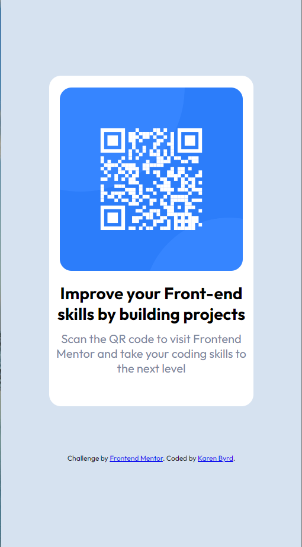

# Frontend Mentor - QR code component solution

This is a solution to the [QR code component challenge on Frontend Mentor](https://klbyrd88.github.io/qr-code-component-main/). 

## Overview
To look at a design and create it exactly as is on the web. 
### Screenshot

### Links

- Solution URL: [Link to GitHub](https://github.com/klbyrd88/qr-code-component-main)
- Live Site URL: [Link to GitHub page](https://klbyrd88.github.io/qr-code-component-main/)

## My process
HTML -  added <main></main>, <footer></footer>, used classes and ids
CSS - added style sheet with basic styling

### Built with

- Semantic HTML5 markup
- CSS custom properties

### What I learned

I am using VSCode and when I use Go Live the images on my local host are how  I want them to look.  When I transfer everything to GitHub and publish in Pages, it always look different.  I am not sure how to correct this, I am going to guess when I load a real site it will do the same thing.  I need to understand how things tansfer.

I have taught myself HTML, CSS, and JavaScript so doing these challenges are actually allowing me to understand the outcome in real life not just on my computer.

### Continued development

I want to continue to work with CSS and HTML.  I have done small projects but they are just on my own computer.  I am going to try and utilize the feedback from everyone and make the finished design better.  I also want to learn how to make my own QRCode - I know I can use a site but if  it's possible  to code it myself I would like to learn.

## Author

- Frontend Mentor - [@yourusername](https://www.frontendmentor.io/profile/klbyrd88)
- Twitter - [@yourusername](https://twitter.com/klb0323)